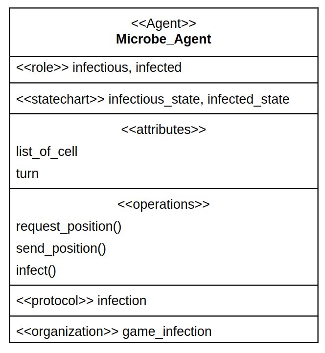
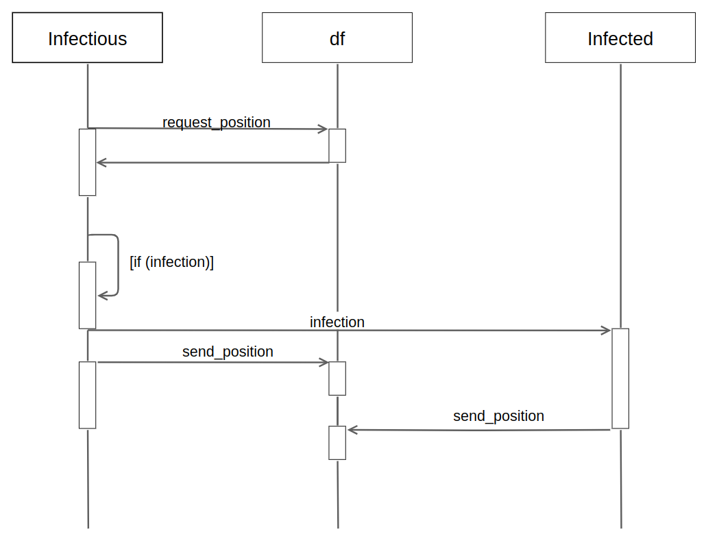
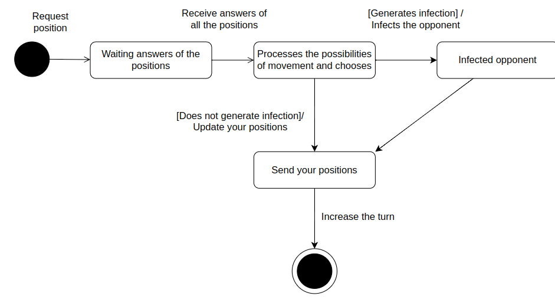
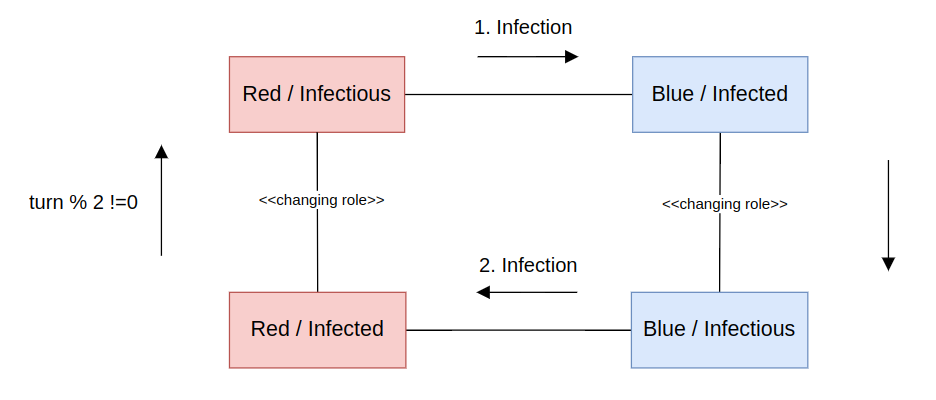
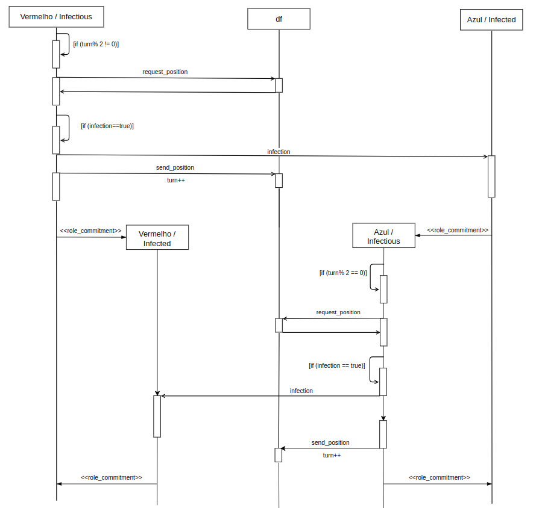

# Diagramas

## Diagrama de classe - AUML

## Diagrama de sequencia/interação - AUML

## Diagrama de estados - AUML

## Diagrama de colaboração - AUML

## Diagrama de sequencia/interação - AUML + MAS-ML

## Referências
- UML. Unified Modeling Language. Disponível online em: https://www.uml-diagrams.org/.
- AUML. Agent Unified Modeling Language. Disponível online em: https://auml.org/.
- FIPA. Foundation for Intelligent Physical Agents. Disponível online em: http://fipa.org/
- Campos, J. P., Oliveira, A. de P., & Braga, J. L. (2010). Modeling Languages for Multiagent Systems: A case study using AUML and MAS-ML. INFOCOMP Journal of Computer Science, 9(2), 57–64. isponível online em: http://177.105.60.18/index.php/infocomp/article/view/302